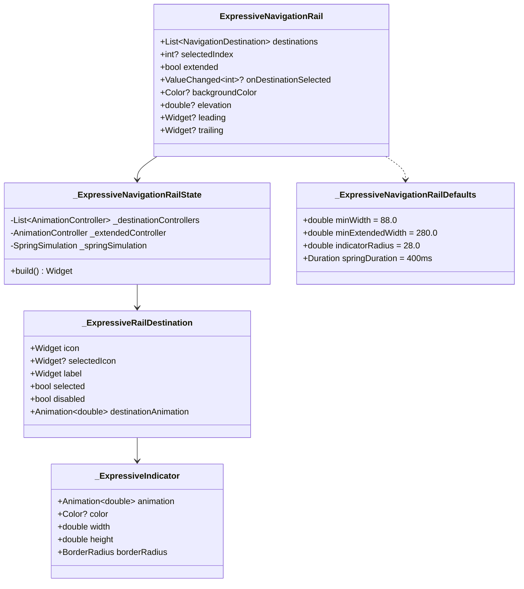

# Design Document: Expressive Navigation Rail

## Overview

Реализация Material 3 Expressive версии NavigationRail для Flutter. Этот компонент предоставляет вертикальную навигацию с выразительными визуальными элементами, включая округлые pill-shaped индикаторы, spring-анимации и улучшенную визуальную обратную связь.

Ключевые отличия от стандартного NavigationRail:
- Pill-shaped индикатор с радиусом 28dp
- Spring-based анимации для всех переходов
- Увеличенные размеры элементов (88dp collapsed, 280dp extended)
- Анимация масштабирования иконок при выборе
- Плавные переходы между collapsed и extended режимами

## Architecture



## Components and Interfaces

### ExpressiveNavigationRail Widget

Главный виджет, управляющий навигацией:

```dart
class ExpressiveNavigationRail extends StatefulWidget {
  const ExpressiveNavigationRail({
    super.key,
    required this.destinations,
    required this.selectedIndex,
    this.onDestinationSelected,
    this.extended = false,
    this.backgroundColor,
    this.elevation,
    this.leading,
    this.trailing,
    this.indicatorColor,
    this.indicatorShape,
    this.minWidth,
    this.minExtendedWidth,
  });

  final List<NavigationDestination> destinations;
  final int? selectedIndex;
  final ValueChanged<int>? onDestinationSelected;
  final bool extended;
  final Color? backgroundColor;
  final double? elevation;
  final Widget? leading;
  final Widget? trailing;
  final Color? indicatorColor;
  final ShapeBorder? indicatorShape;
  final double? minWidth;
  final double? minExtendedWidth;
}
```

### _ExpressiveRailDestination Widget

Внутренний виджет для отдельного элемента навигации:

```dart
class _ExpressiveRailDestination extends StatefulWidget {
  const _ExpressiveRailDestination({
    required this.icon,
    this.selectedIcon,
    required this.label,
    required this.selected,
    required this.disabled,
    required this.destinationAnimation,
    required this.extendedAnimation,
    required this.onTap,
    this.indicatorColor,
  });

  final Widget icon;
  final Widget? selectedIcon;
  final Widget label;
  final bool selected;
  final bool disabled;
  final Animation<double> destinationAnimation;
  final Animation<double> extendedAnimation;
  final VoidCallback onTap;
  final Color? indicatorColor;
}
```

### _ExpressiveIndicator Widget

Виджет индикатора выбора с pill-shaped формой:

```dart
class _ExpressiveIndicator extends StatelessWidget {
  const _ExpressiveIndicator({
    required this.animation,
    required this.color,
    required this.width,
    required this.height,
  });

  final Animation<double> animation;
  final Color? color;
  final double width;
  final double height;
  
  // Использует StadiumBorder с радиусом 28dp
  static const double indicatorRadius = 28.0;
}
```

### Spring Animation Configuration

```dart
// Конфигурация spring-анимации
class _ExpressiveSpringConfig {
  static const double damping = 0.8;
  static const double stiffness = 300.0;
  static const double mass = 1.0;
  static const Duration duration = Duration(milliseconds: 400);
  
  static SpringDescription get spring => SpringDescription(
    mass: mass,
    stiffness: stiffness,
    damping: damping * 2 * math.sqrt(stiffness * mass),
  );
}
```

## Data Models

### Expressive Defaults

```dart
class _ExpressiveNavigationRailDefaults extends NavigationRailThemeData {
  _ExpressiveNavigationRailDefaults(this.context)
    : super(
        elevation: 0.0,
        groupAlignment: -1,
        labelType: NavigationRailLabelType.all,
        useIndicator: true,
        minWidth: 88.0,           // Увеличено с 80dp
        minExtendedWidth: 280.0,  // Увеличено с 256dp
      );

  final BuildContext context;
  late final ColorScheme _colors = Theme.of(context).colorScheme;
  late final TextTheme _textTheme = Theme.of(context).textTheme;

  @override 
  Color? get backgroundColor => _colors.surface;

  @override 
  TextStyle? get unselectedLabelTextStyle {
    return _textTheme.labelLarge!.copyWith(color: _colors.onSurface);
  }

  @override 
  TextStyle? get selectedLabelTextStyle {
    return _textTheme.labelLarge!.copyWith(color: _colors.onSurface);
  }

  @override 
  IconThemeData? get unselectedIconTheme {
    return IconThemeData(
      size: 24.0,
      color: _colors.onSurfaceVariant,
    );
  }

  @override 
  IconThemeData? get selectedIconTheme {
    return IconThemeData(
      size: 28.0,  // Увеличено для selected state
      color: _colors.onSecondaryContainer,
    );
  }

  @override 
  Color? get indicatorColor => _colors.secondaryContainer;

  @override 
  ShapeBorder? get indicatorShape => const StadiumBorder();
  
  // Expressive-specific
  double get indicatorRadius => 28.0;
  double get indicatorMinSize => 56.0;
  double get iconScaleSelected => 1.1;
  double get hoverOpacity => 0.08;
  double get pressOpacity => 0.12;
  double get disabledOpacity => 0.38;
}
```

### Animation State

```dart
class _AnimationState {
  late AnimationController selectionController;
  late AnimationController extendedController;
  late AnimationController scaleController;
  
  late Animation<double> selectionAnimation;
  late Animation<double> extendedAnimation;
  late Animation<double> scaleAnimation;
  late Animation<double> labelFadeAnimation;
  late Animation<Offset> labelSlideAnimation;
}
```

## Correctness Properties

*A property is a characteristic or behavior that should hold true across all valid executions of a system—essentially, a formal statement about what the system should do. Properties serve as the bridge between human-readable specifications and machine-verifiable correctness guarantees.*

### Property 1: Indicator Shape and Size Constraints

*For any* selected destination in the ExpressiveNavigationRail, the selection indicator SHALL have a pill-shaped form with border radius of 28dp and minimum dimensions of 56x56dp.

**Validates: Requirements 1.1, 1.2**

### Property 2: Spring Animation Configuration

*For any* animation in the ExpressiveNavigationRail (selection, extended, scale), the animation SHALL use spring physics with damping ratio of 0.8 and complete within 400ms.

**Validates: Requirements 2.1, 2.3, 2.4, 6.4**

### Property 3: Icon Scale Animation

*For any* destination selection change, the selected icon SHALL animate scale from 1.0 to 1.1 using spring animation.

**Validates: Requirements 2.2**

### Property 4: Icon Color Based on Selection State

*For any* destination, the icon color SHALL be onSecondaryContainer when selected and onSurfaceVariant when unselected.

**Validates: Requirements 3.3, 3.4**

### Property 5: Hover and Press Opacity

*For any* destination interaction, hover state SHALL use 8% opacity of primary color and press state SHALL use 12% opacity.

**Validates: Requirements 3.1, 3.2**

### Property 6: Rail Width Constraints

*For any* ExpressiveNavigationRail, the minimum width SHALL be 88dp in collapsed mode and 280dp in extended mode.

**Validates: Requirements 4.1, 4.2**

### Property 7: Extended Mode Indicator Expansion

*For any* ExpressiveNavigationRail in extended mode, the selection indicator width SHALL expand to encompass both icon and label.

**Validates: Requirements 1.3, 6.2**

### Property 8: Label Animation Sequencing

*For any* extended mode transition, labels SHALL fade in after rail expansion starts (on extend) and fade out before rail collapse completes (on collapse).

**Validates: Requirements 6.1, 6.3**

### Property 9: Disabled State Behavior

*For any* disabled destination, the opacity SHALL be 0.38 and tap events SHALL be ignored.

**Validates: Requirements 7.3, 7.4**

### Property 10: Semantic Accessibility

*For any* destination in the ExpressiveNavigationRail, semantic labels SHALL be provided for screen reader accessibility.

**Validates: Requirements 5.1**

## Error Handling

| Error Condition | Handling Strategy |
|----------------|-------------------|
| selectedIndex out of bounds | Assert in debug, clamp in release |
| Empty destinations list | Render empty rail with leading/trailing only |
| Null selectedIndex | No indicator shown, all destinations unselected |
| Disabled destination selected | Prevent selection, maintain previous state |
| Animation controller disposed | Guard animation calls with mounted check |

## Testing Strategy

### Unit Tests
- Verify default values match Expressive specifications
- Test color calculations for hover/press states
- Test opacity calculations for disabled state
- Test indicator size calculations

### Property-Based Tests
- Use `flutter_test` with custom property generators
- Generate random destination configurations
- Verify all properties hold across generated inputs
- Minimum 100 iterations per property test

### Widget Tests
- Test indicator rendering with correct shape
- Test animation behavior on selection change
- Test extended mode transitions
- Test disabled state visual appearance
- Test accessibility semantics

### Testing Framework
- Primary: `flutter_test` (built-in)
- Property-based: Custom generators with `dart:math` Random
- Each property test tagged with: **Feature: expressive-navigation-rail, Property {N}: {title}**
